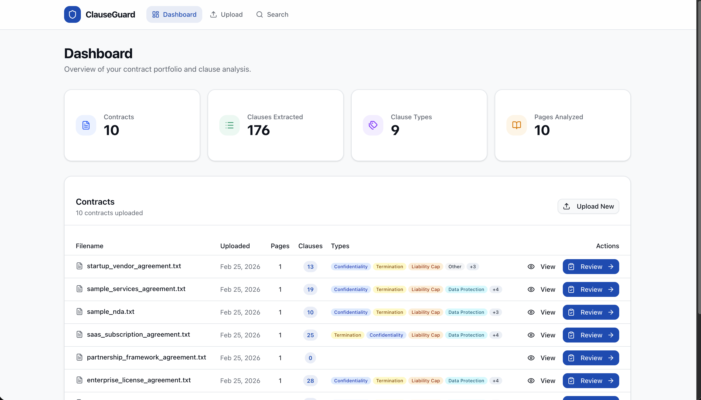
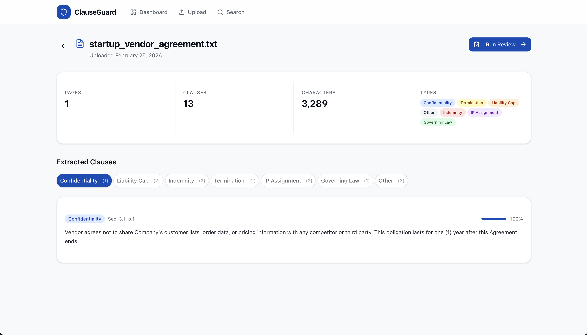
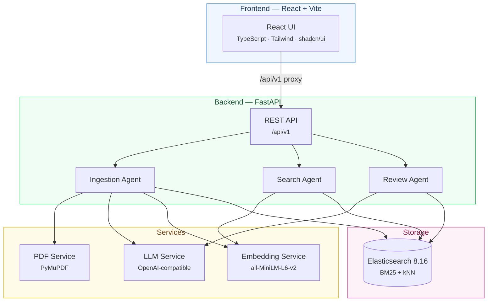
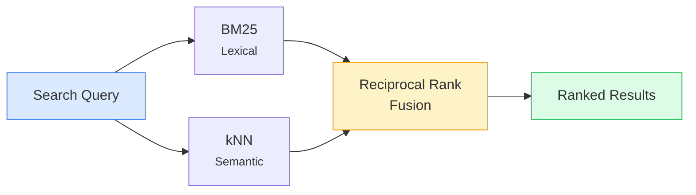
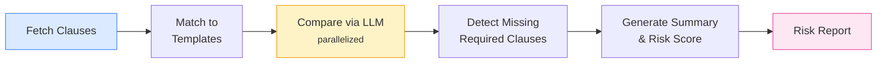

# ClauseGuard

**Multi-agent legal contract review system** that ingests contracts, extracts clauses with AI, enables hybrid semantic search, and generates compliance risk reports against company-approved templates.

---

## Screenshots

| Dashboard | Contract Detail |
|:---------:|:---------------:|
|  |  |

---

## Architecture



---

## How It Works

### Ingestion Pipeline


The **Ingestion Agent** processes uploaded contracts through four stages — parsing the document, using an LLM to extract structured clauses with type classifications and confidence scores, encoding each clause into a 384-dimensional vector, and indexing everything in Elasticsearch.

### Hybrid Search



The **Search Agent** runs two parallel searches — BM25 for exact keyword matching and kNN for meaning-based similarity — then merges them using **Reciprocal Rank Fusion** (`RRF_score = Σ 1/(k + rank)` with k=60).

### Compliance Review



The **Review Agent** compares each clause against company-approved templates in parallel, flags missing required clauses as high severity, and generates an executive summary with an overall risk score (0–10).

---

## Tech Stack

| Layer | Technology |
|:------|:-----------|
| **Frontend** | React 18, TypeScript, Vite, Tailwind CSS, shadcn/ui, React Router |
| **Backend** | Python 3.12+, FastAPI, Pydantic, async/await |
| **LLM** | OpenAI-compatible API (configurable model) |
| **Embeddings** | Sentence Transformers (`all-MiniLM-L6-v2`, 384 dims) |
| **Search** | Elasticsearch 8.16 (hybrid BM25 + kNN with RRF) |
| **PDF** | PyMuPDF |

---

## Getting Started

### Prerequisites

- Python 3.12+
- Node.js 18+
- Docker

### 1. Elasticsearch

```bash
docker compose up -d
```

### 2. Environment

Copy and configure the env file:

```bash
cp .env.example .env
```

```env
LLM_API_KEY=sk-...
LLM_BASE_URL=https://your-openai-compatible-endpoint.com
LLM_MODEL=claude-sonnet-4-5-20250929
```

### 3. Backend

```bash
pip install -e .
clauseguard
```

Starts at `http://localhost:8000`. First run downloads the embedding model (~80MB).

### 4. Frontend

```bash
cd frontend && npm install && npm run dev
```

Starts at `http://localhost:5173`, proxies `/api` to the backend.

### 5. Seed Data (Optional)

```bash
bash seed.sh
```

Uploads 8 sample contracts covering NDAs, SaaS agreements, consulting contracts, and more.

---

## API

All endpoints are prefixed with `/api/v1`.

| Method | Endpoint | Description |
|:-------|:---------|:------------|
| `GET` | `/health` | Health check |
| `POST` | `/contracts/upload` | Upload contract (multipart) |
| `GET` | `/contracts/` | List all contracts |
| `GET` | `/contracts/{id}` | Get contract metadata |
| `GET` | `/contracts/{id}/clauses` | Get extracted clauses |
| `POST` | `/search/` | Hybrid search |
| `POST` | `/review/{id}` | Run compliance review |

<details>
<summary><strong>Example: Upload</strong></summary>

```bash
curl -X POST http://localhost:8000/api/v1/contracts/upload \
  -F "file=@contract.pdf"
```

```json
{
  "contract_id": "uuid",
  "filename": "contract.pdf",
  "num_clauses": 12,
  "clause_types_found": ["indemnity", "termination", "confidentiality"],
  "message": "Contract ingested successfully"
}
```
</details>

<details>
<summary><strong>Example: Search</strong></summary>

```bash
curl -X POST http://localhost:8000/api/v1/search/ \
  -H "Content-Type: application/json" \
  -d '{"query": "limitation of liability", "top_k": 5}'
```
</details>

<details>
<summary><strong>Example: Review</strong></summary>

```bash
curl -X POST http://localhost:8000/api/v1/review/{contract_id}
```

Returns `overall_risk_score`, `summary`, `findings[]`, `coverage`, and `missing_required_clauses`.
</details>

---

## Clause Types

| Type | Required | Key Requirements |
|:-----|:--------:|:-----------------|
| **Indemnity** | Yes | Mutual coverage, breach + negligence, attorneys' fees |
| **Liability Cap** | Yes | 12-month fee cap, consequential damage exclusion |
| **Termination** | Yes | 30-day convenience notice, cure period for cause |
| **Confidentiality** | Yes | Mutual NDA, 3-year survival, third-party restrictions |
| **Governing Law** | Yes | Jurisdiction specified, exclusive venue |
| **Data Protection** | Yes | GDPR/CCPA, DPA requirement, security measures |
| **IP Assignment** | No | Work product ownership, pre-existing IP carve-outs |
| **Force Majeure** | No | Excused performance, notice, 60-day termination right |
| **Other** | — | Catch-all for unclassified clauses |

---

## Project Structure

```
ClauseGuard/
├── clauseguard/                # Backend
│   ├── main.py                 # FastAPI app + CORS
│   ├── config.py               # Settings (env vars)
│   ├── agents/
│   │   ├── ingestion.py        # Parse → Extract → Embed → Index
│   │   ├── search.py           # Hybrid BM25 + kNN
│   │   └── review.py           # Template comparison → Risk report
│   ├── services/
│   │   ├── claude_service.py   # LLM calls (OpenAI-compatible)
│   │   ├── embedding_service.py
│   │   ├── elasticsearch_service.py
│   │   └── pdf_service.py
│   ├── models/                 # Pydantic schemas
│   └── templates/defaults.py   # 8 compliance templates
├── frontend/                   # React app
│   └── src/
│       ├── pages/              # Dashboard, Upload, Detail, Search, Review
│       ├── components/         # RiskGauge, CoverageMap, FindingCard, DropZone
│       └── lib/                # API client, constants, utils
├── sample_contracts/           # 8 sample contracts
├── seed.sh                     # Seed script
├── docker-compose.yml          # Elasticsearch
└── pyproject.toml
```

---

## Configuration

| Variable | Default | Description |
|:---------|:--------|:------------|
| `LLM_API_KEY` | — | API key for LLM service (required) |
| `LLM_BASE_URL` | — | OpenAI-compatible endpoint (required) |
| `LLM_MODEL` | `claude-sonnet-4-5-20250929` | Model for extraction and review |
| `ELASTICSEARCH_URL` | `http://localhost:9200` | Elasticsearch endpoint |
| `EMBEDDING_MODEL` | `all-MiniLM-L6-v2` | Sentence transformer model |

---

## License

MIT
